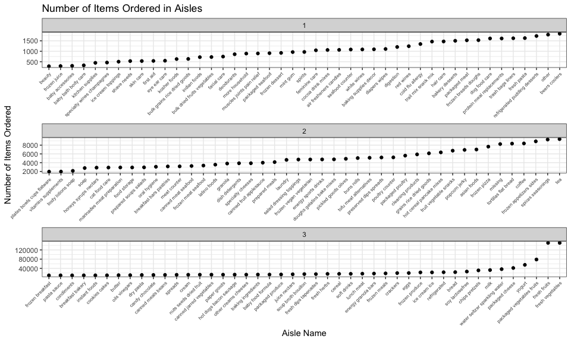
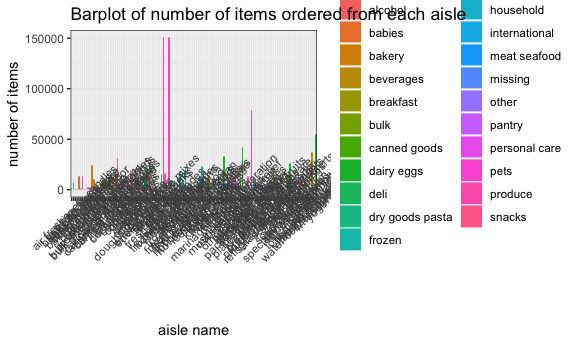

p8105\_hw3\_dl3157
================
Ditian Li
2018/10/11

``` r
devtools::install_github("p8105/p8105.datasets")
```

    ## Skipping install of 'p8105.datasets' from a github remote, the SHA1 (21f5ad1c) has not changed since last install.
    ##   Use `force = TRUE` to force installation

``` r
library(p8105.datasets)
brfss_sm = brfss_smart2010 %>%
janitor::clean_names() %>%
filter(topic == 'Overall Health') %>%
 mutate(response = as.factor(response),
         response = factor(response, levels = c("Excellent", "Very good", "Good", "Fair", "Poor"))) %>% 
  select(year, locationabbr, locationdesc, response, everything()) 
```

``` r
brfss_sm %>%
  group_by(year,locationabbr) %>% 
  summarize(n = n_distinct(locationdesc)) %>% 
  filter(n == 7) %>% 
  filter(year == 2002)
```

    ## # A tibble: 3 x 3
    ## # Groups:   year [1]
    ##    year locationabbr     n
    ##   <int> <chr>        <int>
    ## 1  2002 CT               7
    ## 2  2002 FL               7
    ## 3  2002 NC               7

In 2002, CT, FL and NC were observed at 7 locations.

``` r
brfss_sm %>% 
  group_by(year, locationabbr) %>% 
  summarize(n = n_distinct(locationdesc)) %>% 
  ggplot(aes(x = year, y = n, color = locationabbr)) + 
  geom_point() + geom_line(alpha = .7) + 
  labs( title = "locations in each state from 2002 to 2010",
    x = "Year",
    y = "Number of locations") + 
  theme(legend.position = "left")
```


``` r
brfss_sm1 <- brfss_sm %>% 
  spread(key = "response", value = "data_value") %>% 
  janitor::clean_names() %>% 
  select(year, locationabbr, locationdesc, excellent:poor) %>% 
  filter( year %in% c(2002,2006,2010) ) %>% 
  group_by(year, locationabbr) %>% 
  filter(locationabbr == "NY") %>% 
  summarize(mean_excellent = mean(excellent, na.rm = TRUE),
            sd_excellent = sd(excellent, na.rm = TRUE)) %>% 
  knitr::kable(digits = 3)

brfss_sm1
```

|  year| locationabbr |  mean\_excellent|  sd\_excellent|
|-----:|:-------------|----------------:|--------------:|
|  2002| NY           |           24.040|          4.486|
|  2006| NY           |           22.533|          4.001|
|  2010| NY           |           22.700|          3.567|

``` r
brfss_sm %>% 
  spread(key = "response", value = "data_value") %>% 
  janitor::clean_names() %>% 
  select(year, locationabbr, locationdesc, excellent:poor) %>% 
  group_by(year, locationabbr) %>% 
  summarize(mean_excellent = mean(excellent, na.rm = TRUE),
            mean_very_good = mean(very_good, na.rm = TRUE),
            mean_good = mean(good, na.rm = TRUE),
            mean_fair = mean(fair, na.rm = TRUE),
            mean_poor = mean(poor, na.rm = TRUE)
            ) %>% 
  gather(key = "mean_response", value = "average_proportion",    
  mean_excellent:mean_poor) %>% 
  ggplot(aes(x = year, y = average_proportion, color = locationabbr)) + 
  geom_point() + geom_line() +
  facet_grid(~mean_response) +
  labs(
    title = "Average proportion in each response for each year and each    
    state",
    x = "Year",
    y = "Average proportion"
  ) + theme(legend.position = "none",axis.text.x = element_text(angle = 45))
```


``` r
devtools::install_github("p8105/p8105.datasets")
```

    ## Skipping install of 'p8105.datasets' from a github remote, the SHA1 (21f5ad1c) has not changed since last install.
    ##   Use `force = TRUE` to force installation

``` r
library(p8105.datasets)
instacart
```

    ## # A tibble: 1,384,617 x 15
    ##    order_id product_id add_to_cart_ord… reordered user_id eval_set
    ##       <int>      <int>            <int>     <int>   <int> <chr>   
    ##  1        1      49302                1         1  112108 train   
    ##  2        1      11109                2         1  112108 train   
    ##  3        1      10246                3         0  112108 train   
    ##  4        1      49683                4         0  112108 train   
    ##  5        1      43633                5         1  112108 train   
    ##  6        1      13176                6         0  112108 train   
    ##  7        1      47209                7         0  112108 train   
    ##  8        1      22035                8         1  112108 train   
    ##  9       36      39612                1         0   79431 train   
    ## 10       36      19660                2         1   79431 train   
    ## # ... with 1,384,607 more rows, and 9 more variables: order_number <int>,
    ## #   order_dow <int>, order_hour_of_day <int>,
    ## #   days_since_prior_order <int>, product_name <chr>, aisle_id <int>,
    ## #   department_id <int>, aisle <chr>, department <chr>

overview:

``` r
instacart %>% 
  group_by(aisle) %>% 
  summarize(n_item = n()) %>% 
  arrange(desc(n_item))
```

    ## # A tibble: 134 x 2
    ##    aisle                         n_item
    ##    <chr>                          <int>
    ##  1 fresh vegetables              150609
    ##  2 fresh fruits                  150473
    ##  3 packaged vegetables fruits     78493
    ##  4 yogurt                         55240
    ##  5 packaged cheese                41699
    ##  6 water seltzer sparkling water  36617
    ##  7 milk                           32644
    ##  8 chips pretzels                 31269
    ##  9 soy lactosefree                26240
    ## 10 bread                          23635
    ## # ... with 124 more rows

There are 134 aisles in tha instacart dataset, the most items are ordered from fresh vegetables, fresh fruits, packaged vegetables fruits.

``` r
instacart %>% 
  group_by(aisle, department) %>% 
  summarize(n_item = n()) %>% 
  group_by(department) %>% 
  mutate(n_mean = mean(n_item)) %>% 
  ggplot(aes(x = aisle, y = n_item, color = department)) +   
  geom_point(aes(size = n_item)) +
  theme(axis.title.x =  element_text(angle = 45))
```



``` r
instacart %>% 
  mutate(aisle = as.factor(aisle)) %>% 
  group_by(aisle, department) %>% 
  summarize(n_item = n() ) %>% 
  arrange(n_item) %>% 
  ggplot(aes(x = aisle, y = n_item, fill = department)) + geom_bar(stat = "identity") +
    theme(axis.text.x = element_text(angle = 45)) +
  labs(
    title = "Barplot of number of items ordered from each aisle",
    x = "aisle name",
    y = "number of items"
  )
```



``` r
instacart %>% 
  group_by(aisle, product_name) %>% 
  summarize(count = n()) %>% 
  group_by(aisle) %>% 
  mutate(rank = min_rank(desc(count))) %>%  
  filter(aisle %in% c("baking ingredients", "dog food care", "packaged     
  vegetables fruits")) %>% 
  filter(rank < 2)
```

    ## # A tibble: 2 x 4
    ## # Groups:   aisle [2]
    ##   aisle             product_name                               count  rank
    ##   <chr>             <chr>                                      <int> <int>
    ## 1 baking ingredien… Light Brown Sugar                            499     1
    ## 2 dog food care     Snack Sticks Chicken & Rice Recipe Dog Tr…    30     1

``` r
instacart %>% 
  group_by(product_name, order_dow) %>% 
  summarize(mean_hour = round(mean(order_hour_of_day), digits = 2)) %>% 
  filter(product_name %in% c("Pink Lady Apples", "Coffee Ice Cream")) %>% 
  spread(key = "order_dow", value = "mean_hour") %>% 
  knitr::kable()
```

| product\_name    |      0|      1|      2|      3|      4|      5|      6|
|:-----------------|------:|------:|------:|------:|------:|------:|------:|
| Coffee Ice Cream |  13.77|  14.32|  15.38|  15.32|  15.22|  12.26|  13.83|
| Pink Lady Apples |  13.44|  11.36|  11.70|  14.25|  11.55|  12.78|  11.94|

``` r
devtools::install_github("p8105/p8105.datasets")
```

    ## Skipping install of 'p8105.datasets' from a github remote, the SHA1 (21f5ad1c) has not changed since last install.
    ##   Use `force = TRUE` to force installation

``` r
library(p8105.datasets)
ny_noaa
```

    ## # A tibble: 2,595,176 x 7
    ##    id          date        prcp  snow  snwd tmax  tmin 
    ##    <chr>       <date>     <int> <int> <int> <chr> <chr>
    ##  1 US1NYAB0001 2007-11-01    NA    NA    NA <NA>  <NA> 
    ##  2 US1NYAB0001 2007-11-02    NA    NA    NA <NA>  <NA> 
    ##  3 US1NYAB0001 2007-11-03    NA    NA    NA <NA>  <NA> 
    ##  4 US1NYAB0001 2007-11-04    NA    NA    NA <NA>  <NA> 
    ##  5 US1NYAB0001 2007-11-05    NA    NA    NA <NA>  <NA> 
    ##  6 US1NYAB0001 2007-11-06    NA    NA    NA <NA>  <NA> 
    ##  7 US1NYAB0001 2007-11-07    NA    NA    NA <NA>  <NA> 
    ##  8 US1NYAB0001 2007-11-08    NA    NA    NA <NA>  <NA> 
    ##  9 US1NYAB0001 2007-11-09    NA    NA    NA <NA>  <NA> 
    ## 10 US1NYAB0001 2007-11-10    NA    NA    NA <NA>  <NA> 
    ## # ... with 2,595,166 more rows
