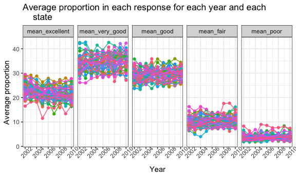
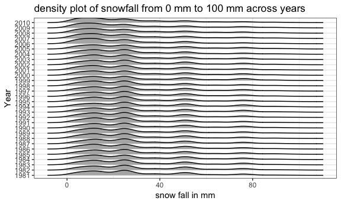

p8105\_hw3\_dl3157
================
Ditian Li
2018/10/11

Problem 1
---------

``` r
devtools::install_github("p8105/p8105.datasets")
```

    ## Skipping install of 'p8105.datasets' from a github remote, the SHA1 (21f5ad1c) has not changed since last install.
    ##   Use `force = TRUE` to force installation

``` r
library(p8105.datasets)
brfss_sm = brfss_smart2010 %>%
janitor::clean_names() %>%
filter(topic == 'Overall Health') %>%
 mutate(response = as.factor(response),
         response = factor(response, levels = c("Excellent", "Very good", "Good", "Fair", "Poor"))) %>% 
  select(year, state = locationabbr, county = locationdesc, response, everything()) 
levels(brfss_sm$response)
```

    ## [1] "Excellent" "Very good" "Good"      "Fair"      "Poor"

Comment: We've done data cleaning part and reordered data by response.

Question 1

``` r
brfss_sm %>%
  group_by(year,state) %>% 
  summarize(n = n_distinct(county)) %>% 
  filter(n == 7) %>% 
  filter(year == 2002)
```

    ## # A tibble: 3 x 3
    ## # Groups:   year [1]
    ##    year state     n
    ##   <int> <chr> <int>
    ## 1  2002 CT        7
    ## 2  2002 FL        7
    ## 3  2002 NC        7

Comment: From result we know, in 2002, CT, FL and NC were observed at 7 locations.

Question 2

``` r
brfss_sm %>% 
  group_by(year, state) %>% 
  summarize(n = n_distinct(county)) %>% 
  ggplot(aes(x = year, y = n, color = state)) + 
  geom_point() + geom_line(alpha = .7) + 
  labs( title = "locations in each state from 2002 to 2010",
    x = "Year",
    y = "Number of locations") + 
  theme(legend.position = "left")
```


Comment: From result, from 2002 to 2010 for most states, the number of locations in each state is below 20, however, Florida has two peak value above 40.

Question 3

``` r
brfss_sm1 <- brfss_sm %>% 
  spread(key = "response", value = "data_value") %>% 
  janitor::clean_names() %>% 
  select(year, state, county, excellent:poor) %>% 
  filter( year == 2002 | year == 2006 | year == 2010) %>% 
  group_by(county) %>% 
  filter(state == "NY") %>% 
  summarize(mean_excellent = mean(excellent, na.rm = TRUE),
            sd_excellent = sd(excellent, na.rm = TRUE)) %>% 
  knitr::kable(digits = 1)

brfss_sm1
```

| county                  |  mean\_excellent|  sd\_excellent|
|:------------------------|----------------:|--------------:|
| NY - Bronx County       |             17.6|             NA|
| NY - Erie County        |             17.2|             NA|
| NY - Kings County       |             20.4|            1.8|
| NY - Monroe County      |             22.4|             NA|
| NY - Nassau County      |             24.9|            2.8|
| NY - New York County    |             27.5|            1.5|
| NY - Queens County      |             19.6|            1.4|
| NY - Suffolk County     |             24.1|            3.3|
| NY - Westchester County |             26.4|            0.6|

Comment: For New York state, the min of excellent mean is 17.2, the max of excellent mean is 27.5, there are three "NA" for sd\_excellent, and range for sd\_excellent is from 0.6 to 3.3.

Question 4

``` r
brfss_sm %>% 
  spread(key = "response", value = "data_value") %>% 
  janitor::clean_names() %>% 
  select(year, state, county, excellent:poor) %>% 
  group_by(year, state) %>% 
  summarize(mean_excellent = mean(excellent, na.rm = TRUE),
            mean_very_good = mean(very_good, na.rm = TRUE),
            mean_good = mean(good, na.rm = TRUE),
            mean_fair = mean(fair, na.rm = TRUE),
            mean_poor = mean(poor, na.rm = TRUE)
            ) %>% 
  gather(key = "mean_response", value = "average_proportion",    
  mean_excellent:mean_poor) %>%
  mutate(mean_response = as.factor(mean_response),
  mean_response = factor(mean_response, levels = c("mean_excellent", "mean_very_good", "mean_good", "mean_fair", "mean_poor"))) %>% 
  ggplot(aes(x = year, y = average_proportion, color = state)) + 
  geom_point() + geom_line() +
  facet_grid(~mean_response) +
  labs(
    title = "Average proportion in each response for each year and each    
    state",
    x = "Year",
    y = "Average proportion"
  ) + theme(legend.position = "none",axis.text.x = element_text(angle = 45))
```



Comment: We have 5 spaghetti plot for mean proportions of different responses. From result it seems that we have same trend and range of value for each response type from 2002-2010 across year.

``` r
devtools::install_github("p8105/p8105.datasets")
```

    ## Skipping install of 'p8105.datasets' from a github remote, the SHA1 (21f5ad1c) has not changed since last install.
    ##   Use `force = TRUE` to force installation

``` r
library(p8105.datasets)
instacart
```

    ## # A tibble: 1,384,617 x 15
    ##    order_id product_id add_to_cart_ord… reordered user_id eval_set
    ##       <int>      <int>            <int>     <int>   <int> <chr>   
    ##  1        1      49302                1         1  112108 train   
    ##  2        1      11109                2         1  112108 train   
    ##  3        1      10246                3         0  112108 train   
    ##  4        1      49683                4         0  112108 train   
    ##  5        1      43633                5         1  112108 train   
    ##  6        1      13176                6         0  112108 train   
    ##  7        1      47209                7         0  112108 train   
    ##  8        1      22035                8         1  112108 train   
    ##  9       36      39612                1         0   79431 train   
    ## 10       36      19660                2         1   79431 train   
    ## # ... with 1,384,607 more rows, and 9 more variables: order_number <int>,
    ## #   order_dow <int>, order_hour_of_day <int>,
    ## #   days_since_prior_order <int>, product_name <chr>, aisle_id <int>,
    ## #   department_id <int>, aisle <chr>, department <chr>

``` r
sum(is.na(instacart))
```

    ## [1] 0

``` r
nrow(distinct(instacart, order_id))
```

    ## [1] 131209

``` r
nrow(distinct(instacart, user_id))
```

    ## [1] 131209

``` r
nrow(distinct(instacart, product_id))
```

    ## [1] 39123

Overview: The dimension of dataset instacart is 1384617\*15=20769255, there is no missing data in instacart. For key variables we are interested in, there are 131209 orders, 131209 users and 39123 products in instacart.

Question 1

``` r
instacart %>% 
  group_by(aisle) %>% 
  summarize(n_item = n()) %>% 
  arrange(desc(n_item))
```

    ## # A tibble: 134 x 2
    ##    aisle                         n_item
    ##    <chr>                          <int>
    ##  1 fresh vegetables              150609
    ##  2 fresh fruits                  150473
    ##  3 packaged vegetables fruits     78493
    ##  4 yogurt                         55240
    ##  5 packaged cheese                41699
    ##  6 water seltzer sparkling water  36617
    ##  7 milk                           32644
    ##  8 chips pretzels                 31269
    ##  9 soy lactosefree                26240
    ## 10 bread                          23635
    ## # ... with 124 more rows

There are 134 aisles in tha instacart dataset, the most item ordered from fresh is vegetables, and then it comes to fresh fruits, packaged vegetables fruits(which indicates the great demand in healthy food).

Question 2

``` r
instacart1 <- instacart %>% 
  group_by(aisle) %>% 
  summarize(n_item = n()) %>% 
  mutate(group = as.numeric(cut_number(n_item, 3))) %>% 
  ggplot(aes(x = reorder(aisle, n_item), y = n_item)) +
    geom_point() +
    facet_wrap(group ~ ., nrow = 3, scales = "free") +
    theme(axis.text.x = element_text(size = 6, hjust = 1, angle = 45)) +
    labs(
      title = "Number of Items Ordered in Aisles",
      x = "Aisle Name",
      y = "Number of Items Ordered"
      )
instacart1
```


Comment: In this question, we dividies our plot into 3 parts to make it clear. From the result, fresh vegetables and fresh fruits have largest numbers of items ordered in aisles, which is consistent with our conclusion in question above. Beauty has the lowest number of items ordered in aisles.

Question 3

``` r
instacart %>%  
  filter(aisle == "baking ingredients" | aisle == "dog food care" | aisle == "packaged vegetables fruits") %>% 
  group_by(aisle, product_name) %>% 
  summarize(count = n()) %>% 
  group_by(aisle) %>% 
  mutate(rank = min_rank(desc(count))) %>%  
  filter(rank < 2)
```

    ## # A tibble: 3 x 4
    ## # Groups:   aisle [3]
    ##   aisle                  product_name                          count  rank
    ##   <chr>                  <chr>                                 <int> <int>
    ## 1 baking ingredients     Light Brown Sugar                       499     1
    ## 2 dog food care          Snack Sticks Chicken & Rice Recipe D…    30     1
    ## 3 packaged vegetables f… Organic Baby Spinach                   9784     1

Comment: From result, the most popular item in "baking ingredients","dog food care" and "packaged vegetables fruits" are Light brown sugar, Snack Sticks Chicken & Rice Recipe Dog Treats and Organic Baby Spinach respectively. The order quantity is quite different(Light brown suga=499, Snack Sticks Chicken & Rice Recipe Dog Treats=30, Organic Baby Spinach=9784).

Question 4

``` r
instacart %>% 
  group_by(product_name, order_dow) %>% 
  summarize(mean_hour = round(mean(order_hour_of_day), digits = 1)) %>% 
  filter(product_name %in% c("Pink Lady Apples", "Coffee Ice Cream")) %>% 
  spread(key = "product_name", value = "mean_hour") %>% 
  knitr::kable()
```

|  order\_dow|  Coffee Ice Cream|  Pink Lady Apples|
|-----------:|-----------------:|-----------------:|
|           0|              13.8|              13.4|
|           1|              14.3|              11.4|
|           2|              15.4|              11.7|
|           3|              15.3|              14.2|
|           4|              15.2|              11.6|
|           5|              12.3|              12.8|
|           6|              13.8|              11.9|

Comment: order\_dow represents Sunday=0 to Saturday=6. People order Pink Lady Apples from 11 to 14 on average, it is the time overlap the lunch break. For the Coffee Ice Cream, it is ordered from 13 to 16.

``` r
devtools::install_github("p8105/p8105.datasets")
```

    ## Skipping install of 'p8105.datasets' from a github remote, the SHA1 (21f5ad1c) has not changed since last install.
    ##   Use `force = TRUE` to force installation

``` r
library(p8105.datasets)
ny_noaa
```

    ## # A tibble: 2,595,176 x 7
    ##    id          date        prcp  snow  snwd tmax  tmin 
    ##    <chr>       <date>     <int> <int> <int> <chr> <chr>
    ##  1 US1NYAB0001 2007-11-01    NA    NA    NA <NA>  <NA> 
    ##  2 US1NYAB0001 2007-11-02    NA    NA    NA <NA>  <NA> 
    ##  3 US1NYAB0001 2007-11-03    NA    NA    NA <NA>  <NA> 
    ##  4 US1NYAB0001 2007-11-04    NA    NA    NA <NA>  <NA> 
    ##  5 US1NYAB0001 2007-11-05    NA    NA    NA <NA>  <NA> 
    ##  6 US1NYAB0001 2007-11-06    NA    NA    NA <NA>  <NA> 
    ##  7 US1NYAB0001 2007-11-07    NA    NA    NA <NA>  <NA> 
    ##  8 US1NYAB0001 2007-11-08    NA    NA    NA <NA>  <NA> 
    ##  9 US1NYAB0001 2007-11-09    NA    NA    NA <NA>  <NA> 
    ## 10 US1NYAB0001 2007-11-10    NA    NA    NA <NA>  <NA> 
    ## # ... with 2,595,166 more rows

``` r
ny_noaa %>% 
  group_by(id) %>% 
  summarize(prcp_na = sum(is.na(prcp)),
            snow_na = sum(is.na(snow)),
            snwd_na = sum(is.na(snwd)),
            tmax_na = sum(is.na(tmax)),
            tmin_na = sum(is.na(tmin)))
```

    ## # A tibble: 747 x 6
    ##    id          prcp_na snow_na snwd_na tmax_na tmin_na
    ##    <chr>         <int>   <int>   <int>   <int>   <int>
    ##  1 US1NYAB0001      60     252     874    1157    1157
    ##  2 US1NYAB0006      19     283     703     852     852
    ##  3 US1NYAB0010     220     352     816     822     822
    ##  4 US1NYAB0016      98     152     212     214     214
    ##  5 US1NYAB0017     301     415     459     459     459
    ##  6 US1NYAB0021       2      37      72     365     365
    ##  7 US1NYAB0022     233     238     239     273     273
    ##  8 US1NYAB0023     144     238     289     365     365
    ##  9 US1NYAB0025      40      43      43     215     215
    ## 10 US1NYAL0002      57     245     409     549     549
    ## # ... with 737 more rows

Description: The dimension of ny\_noaa dataset is 2,595,176 x 7, in this dataset we have id, date of observation, precipitation, snowfall in mm, snow depth in mm, maximum temperature and minimum temprature both in degree centigrade on each day across 1981 t0 2010. From result we notice that missing data is a big problem since large proportion of data is missing in ny\_noaa.

Question 1

``` r
ny_noaa1 <- ny_noaa %>% 
  separate(date, into = c("year", "month", "day"), sep = "-") %>% 
  mutate(prcp = prcp / 10,
         tmax = as.numeric(tmax) / 10,
         tmin = as.numeric(tmin) / 10)
  count(ny_noaa, snow) %>% arrange(desc(n))
```

    ## # A tibble: 282 x 2
    ##     snow       n
    ##    <int>   <int>
    ##  1     0 2008508
    ##  2    NA  381221
    ##  3    25   31022
    ##  4    13   23095
    ##  5    51   18274
    ##  6    76   10173
    ##  7     8    9962
    ##  8     5    9748
    ##  9    38    9197
    ## 10     3    8790
    ## # ... with 272 more rows

Comment: For snowfall, the most commonly observed value is 0 degree centigrade, because we only have snowfall during winter, which only happens not that frequently in locations we observed.

Question 2

``` r
ny_noaa1 %>% 
  group_by(id, year, month) %>% 
  summarize(mean_tmax = round(mean(tmax, na.rm = TRUE), digits = 1),
            mean_tmin = round(mean(tmin, na.rm = TRUE), digits = 1)) %>% 
  na.omit() %>% 
  gather(key = mean_temp, value = temp, mean_tmax) %>%
  filter(month %in% c("01", "07")) %>% 
  ggplot(aes(x = year, y = temp)) + geom_boxplot() +   
  facet_grid(~month) + 
  theme(axis.text.x = element_text(size = 5, angle = 45),legend.position = "bottom") +
   labs(
    title = "Average max temperature in January and July in each station  
    from 1981 to 2010", x = "Year", y = "Average max temperature in ˚C"
  )
```


Comment: From box plot we can conclude that there is approximate same pattern for tmax across years. For tmax in Jan, the range of tmax is from -10 to 5 degree, for tmax in July, the tmax is from 25 to 30. We do have outliers, for example, in Jan 1982, we have an outlier below -10 degree; in July 1987, we have an outlier below 15 degree.

Question 3

``` r
ny_noaa2 <- ny_noaa1 %>% 
  ggplot(aes(x = tmax, y = tmin)) + geom_hex()  +
  labs(
    title = "Hex plot of maximum temperature/minimum temperature",
    x = "maximum temperature",
    y = "minimum temperature"
  )
ny_noaa2
```

    ## Warning: Removed 1136276 rows containing non-finite values (stat_binhex).


``` r
ny_noaa3 <- ny_noaa1 %>% 
  filter(snow > 0 & snow < 100) %>% 
  ggplot(aes(x = snow, y = year)) + geom_density_ridges(scale = 1) +
  labs(
    title = "density plot of snowfall from 0 mm to 100 mm across years",
    x = "snow fall in mm", y = "Year")
ny_noaa3
```

    ## Picking joint bandwidth of 3.76



Comment: From hexplot we can conclude that tmax and tmin have approximate linear relationship, the light blue means there are more counts in the plot.From ridges plot of snowfall we know, we have same pattern of snowfall distribution across years.
